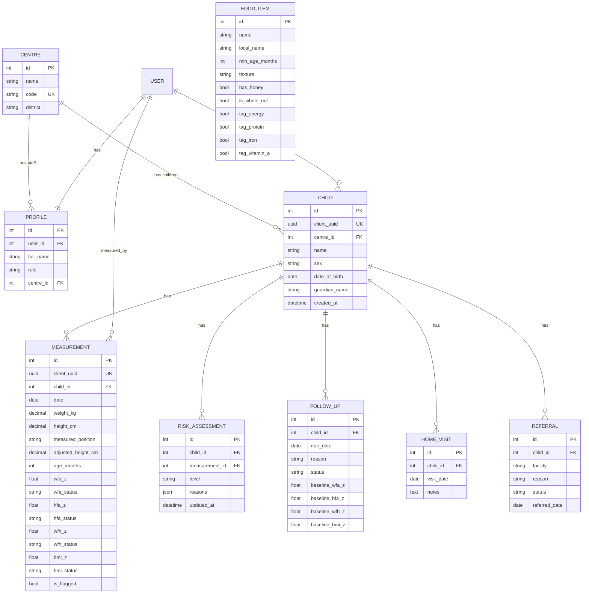

# ER Diagram

```mermaid
erDiagram
    CENTRE ||--o{ PROFILE : "has staff"
    CENTRE ||--o{ CHILD : "has children"
    USER ||--|| PROFILE : "has"
    USER ||--o{ CHILD : "registered_by"
    CHILD ||--o{ MEASUREMENT : "has"
    USER ||--o{ MEASUREMENT : "measured_by"
    CHILD ||--o{ RISK_ASSESSMENT : "has"
    CHILD ||--o{ FOLLOW_UP : "has"
    CHILD ||--o{ HOME_VISIT : "has"
    CHILD ||--o{ REFERRAL : "has"

    CENTRE {
        int id PK
        string name
        string code UK
        string district
    }
    PROFILE {
        int id PK
        int user_id FK
        string full_name
        string role
        int centre_id FK
    }
    CHILD {
        int id PK
        uuid client_uuid UK
        int centre_id FK
        string name
        string sex
        date date_of_birth
        string guardian_name
        datetime created_at
    }
    MEASUREMENT {
        int id PK
        uuid client_uuid UK
        int child_id FK
        date date
        decimal weight_kg
        decimal height_cm
        string measured_position
        decimal adjusted_height_cm
        int age_months
        float wfa_z
        string wfa_status
        float hfa_z
        string hfa_status
        float wfh_z
        string wfh_status
        float bmi_z
        string bmi_status
        bool is_flagged
    }
    FOOD_ITEM {
        int id PK
        string name
        string local_name
        int min_age_months
        string texture
        bool has_honey
        bool is_whole_nut
        bool tag_energy
        bool tag_protein
        bool tag_iron
        bool tag_vitamin_a
    }
    RISK_ASSESSMENT {
        int id PK
        int child_id FK
        int measurement_id FK
        string level
        json reasons
        datetime updated_at
    }
    FOLLOW_UP {
        int id PK
        int child_id FK
        date due_date
        string reason
        string status
        float baseline_wfa_z
        float baseline_hfa_z
        float baseline_wfh_z
        float baseline_bmi_z
    }
    HOME_VISIT {
        int id PK
        int child_id FK
        date visit_date
        text notes
    }
    REFERRAL {
        int id PK
        int child_id FK
        string facility
        string reason
        string status
        date referred_date
    }
```
